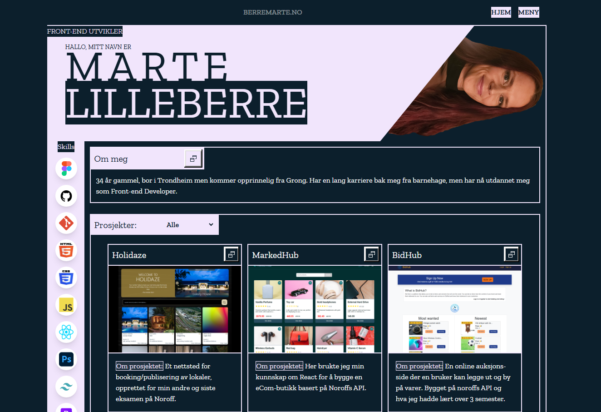

# Portfolio 2 CA
[](https://app.netlify.com/sites/berremarte/deploys)

 <br>

Noroff Portfolio 2 CA, March 2025<br>
[View the website live on Netlify](https://berremarte.netlify.app/)

## Description

This project uses React and Vite, and was designed in Figma. I was tasked to upadte my Portfolio, and i went with a whole new look and feel. The portfolio had to display my last three big projects at Noroff as cards.

## Built With

- Tailwind
- CSS
- JavaScript
- React
  - React Router
  - React-icons
- Vite
- Prettier

## Getting Started

### Installing

1. Clone the repo:

```bash
git clone https://github.com/Berrinj/Portfolio2.git
```

### Running

1. Clone the repo
2. Run repo in a code editor, I suggest using "VScode".
3. Run npm i.
4. Run npm run dev and follow link in the terminal

## Contributing

Feedback is appreciated

## Contact

[Send me an email](mailto:berremarte@gmail.com)

[www.linkedin.com](https://www.linkedin.com/in/marte-lilleberre-1013b326a/)
